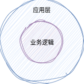
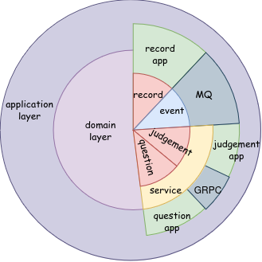
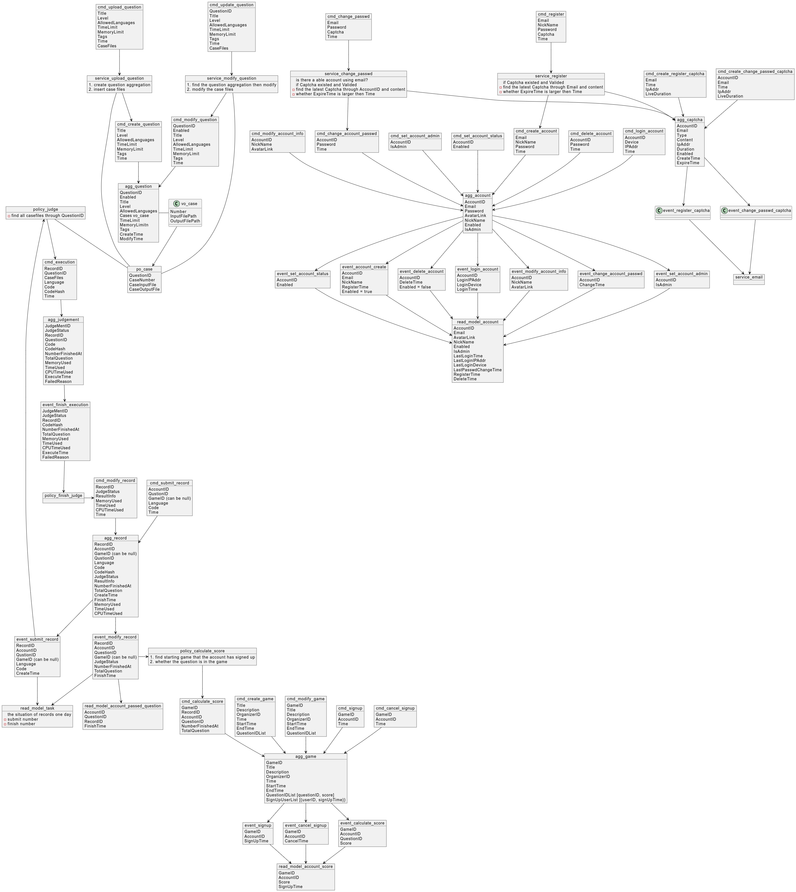
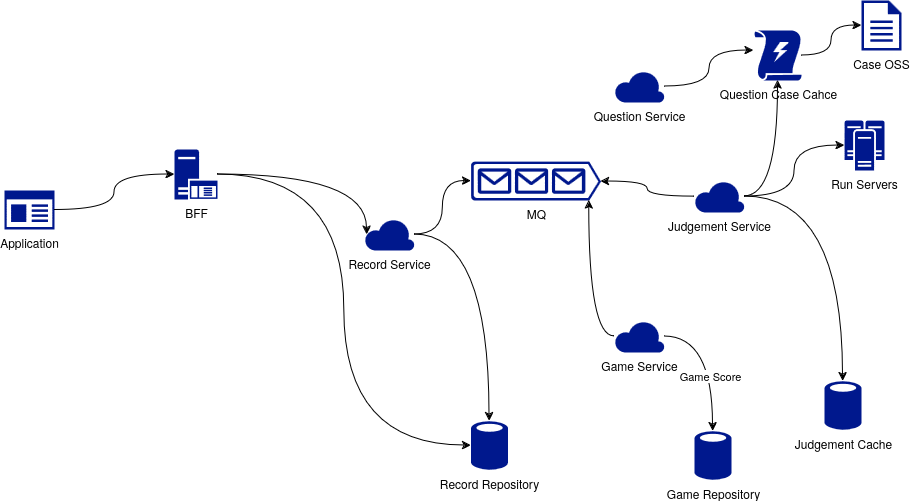

## 项目设计

### 代码结构

项目使用六边形架构组织，对于一个服务应用来说，业务逻辑不依赖任何具体的应用代码，而是依赖统一的抽象接口。应用层实现这些抽象接口从而做到**控制反转**，减少业务逻辑与应用代码的耦合，提高系统的可扩展性。

如图所示：

<div align="center">
    
</div>

在业务逻辑中引入 DDD + CQRS ，代码结构示例图：

<div align="center">
    
</div>


为了进一步降低微服务间的代码耦合，实现各应用要能做到独立部署与更新，应用间的交互只能通过**消息队列**与**GRPC**，禁止任何应用层代码间的依赖。由此，提高了代码的防侵入性。

在 Golang 中实现，就需要每个 Application 创建独立的 module ，且每个 module 都有自己的依赖(go.mod)，相互之间没有任何依赖。

> domain models 也需要创建单独的 module，其他的 application model 只依赖于它。

目录结构：
```
.
├── apps # 各服务应用的代码 ---+
│   ├── game              # |
│   ├── judgement         # |
│   ├── question          # |
│   ├── record            # | 依赖 / 实现
│   ├── user              # |
│   └── web-bff           # |
├── builds                # |
├── docs                  # |
├── domain # 领域模型的代码 <--+
├── go.work
├── go.work.sum
...
```
> 本项目使用了 Golang 的 Workspace 功能来组织这些 module ，这是因为把 domain 和 application 代码都放同一个仓库中便于开发，如果每份代码都分别发布在不同的仓库也是可行的。

### 领域模型

事件风暴，如下图所示：

<div align="center">
    
</div>

领域模型的详细设计，如下图所示：

<div align="center">
    
</div>

### 应用层

设计时的主要考虑：
* 判题服务、判题机 --(解耦)--> SOA --(规范)--> 微服务
* 判题机器资源 --(降低成本)--> 分布式
* 支持多开发语言 --(解耦)--> grpc + k8s + ServiceMesh

本项目虽然设计成微服务，并选用了 ServiceMesh 作为服务治理方案，但尽量依赖轻量、简单的中间件，降低开发成本和部署难度。

#### 判题设计

判题服务的设计拓扑，如下图所示：
<div align="center">
    
</div>

一次对判题服务的请求执行流程如下：
1. 用户提交 Record，包含题目编号、语言、代码等信息。
2. Record Service 产生相应的事件，通过消息队列发送到 Judgement Service
3. Judgement Service 获取题目信息、题目资源限制、测评样例等信息。
4. Judgement Service 调用判题机，执行判题任务。
5. 判题结束后，将结果事件传入消息队列。
6. Record Service 消费结果事件，将结果写入数据库。
7. 如果用户提交的 Record 为比赛答题，那么 Game Service 监听到记录修改事件，会计算用户比赛得分，并写入数据库。

#### 消息队列

使用消息队列目的：

* 在领域模型设计中，聚合间传递 event 来触发 command 执行领域逻辑，如果两个聚合被划分到不同的服务里，应用层就需要通过消息队列来传递 event ，从而实现聚合间的解耦。
* 在比赛判题场景下，需要在比赛期间内处理大量的判题请求，而判题机消费能力有限，因此需要使用消息队列来提高判题业务的吞吐量;使用消息队列同时还起到流量削峰的作用，因为考试场景中判题与计算得分的请求处理实时性要求并不高，所以可以把任务积压在消息队列中，待后续逐步处理。

选用 NSQ 作为消息队列的原因：
* NSQ 的架构简单，轻量高效，包含生产者、消费者、消息队列和注册中心，没有复杂的依赖关系，易于部署、扩展水平扩展和管理。
* 消息传递延迟低、且保证至少一次交付。
* 消息主要在内存中传递，可配置透明持久化到硬盘，防止消息丢失。

#### 持久化

项目仓储的实现选用 MongoDB，将聚合对象和读模型等都持久化其中。

选用 MongoDB 的优点：
* MongoDB 使用 BSON 格式存储数据，使得数据结构可以灵活且动态地适应不同的需求，既利于后续的扩展，也利于使用 ORM 的方式存取数据。
* 支持嵌套文档和数组，使得设计和建模更贴近聚合对象，同时也能使用 ID 来引用对象，能够更灵活地设计对象间的关系。
* 支持跨文档的事务，支持并发读写，提高了系统的性能和可靠性，能增强数据一致性。
* MongoDB 支持 Sharding，可以通过添加更多的节点来扩展存储和处理能力，适合处理大规模的数据。
* 使用平台提供的云存储服务，支持数据的高可用性和自动故障转移，确保系统在出现故障时能够继续运行。

项目选用 Minio 作为对象存储，将测评样例输入、对应答案文本文件存储到其中。

选用 Minio 的优点：

* 轻量高性能的对象存储系统，能够提供快速的数据存取速度。
* MinIO 支持使用本地硬盘存储和集成云存储，能够在保证性能的同时降低存储成本。
* MinIO 支持分布式部署和数据冗余，提供高可用性和容错能力。它可以在多个节点之间进行数据复制，以确保在节点故障时数据的安全性和可用性。

#### 分布式事务

因为判题操作涉及到多个服务，跨服务间通信会受到网络、断电、服务重启等等情况影响，为了确保业务逻辑的正确性以及数据的一致性，需要引入分布式事务来保证 **BASE** 并实现最终一致性。

由于判题操作业务并不复杂并且未来也不会引入其他服务，而且需要保证判题操作必须成功，所以使用**本地消息表**来实现分布式事务。

从拓扑图中可以分析出，判题操作涉及到的主要服务为:
* Record Service
* Judgement Service
* Game Service
* Question Service

首先，必须保证这些服务相关的接口都是**幂等**的，比如：
* Record Service
  * Read: 获取某条 Record 的信息，要保证幂等，无论调用多少次，都不会改变 Record 的状态。
  * Create: 提交一条 Record，要保证幂等，无论调用多少次，都只会新增加而不会修改历史的 Record。
  * Update: 修改 Record 状态，消费结果事件时，会更新 Record 的状态，要保证幂等，即如果 Record 状态已经为完成，那么无论调用多少次，都不会改变 Record 的状态。
* Judgement Service
  * Create: 对提交的 Record 执行一次判题，要保证幂等，对同一条 Record 无论判题多少次，结果都应当一样。
* Question Service
  * Read: 获取题目信息，要保证幂等，无论调用多少次，都不会改变题目信息，或测评样例。
* Game Service
  * Update: 更新用户的比赛成绩，要保证幂等，即如果一次评测的通过样例数并没有超过上次最大数，无论调用多少次，都不会改变用户的成绩。
  
因此，**本地消息表的设计**如下：

在 Record Service 中：
1. 先持久化记录 Record 的状态，并启动定时任务，定时检查本地消息表，将状态为待判的记录发送到消息队列。
2. 监听消息队列中判题结果事件，将记录状态修改为完成，同时将记录信息写入数据库。
3. 如果本次 Record 是比赛判题，则向消息队列发出记录修改事件，通知 Game Service 更新用户的比赛成绩。

在 Judgement Service 中：
1. 监听消息队列中判题请求事件，请求 Question Service 获取题目信息，执行判题目。
2. 判题结束后向消息队列发送判题结果事件。

在 Question Service 中：
* 因为在判题操作中 Question Service 是一个独立的服务，被 Judgement Service 调用来查询题目信息，因此不需要考虑。

在 Game Service 中：
1. 监听消息队列中记录修改事件，更新用户的比赛成绩。

**设计回滚机制**：

使用本地消息表来实现分布式事务，需要保证每个操作最大努力一次交付成功，以下从失败情况出发分析回滚策略：
* Record Service 失败情况：
  1. 提交 Record 失败，无需回滚，直接报错，放弃后续步骤。
  2. 发送判题请求事件失败，无需回滚，后续定时任务会持续派发事件。
  3. 消费结果事件失败，没有修改记录状态，无需回滚，后续定时任务会持续派发事件重新执行判题。
  4. 消费结果事件成功，修改记录状态失败，无需回滚，后续定时任务会持续派发事件重新执行判题。
  5. 消费结果事件成功，修改记录状态成功，发送记录修改事件失败，需要回滚。
* Judgement Service 失败情况：
  1. 请求 Question Service 获取题目信息失败，无需回滚，因为 Record Service 会持续重新判题。
  2. 请求判题机判题失败，无需回滚，因为 Record Service 会持续重新判题。
  3. 判题成功，发送结果事件失败，无需回滚，因为 Record Service 会持续重新判题。
* Game Service 失败情况：
  1. 记录修改事件消费失败，需要重试，重新发送修改事件消费。
  2. 记录修改事件消费成功，更新用户的比赛成绩失败，需要重试，重新发送修改事件消费。


由此分析，由于 Record Service 是判题操作的主要服务，Record Service 会重复发送判题请求事件，直到判题结束，而 Judgement Service 和 Question Service 不会修改任何数据状态，因此无需考虑回滚策略。

因为 Game Service 后续没有跨其他服务的操作，因此无需考虑回滚策略。

Record Service 判题结束后，修改了记录状态，由于还需要发送记录修改事件触发比赛成绩计算，因此需要考虑回滚策略。

**解决方案**：
1. 设计 Record Service 回滚策略，在判题结束后，如果发送记录修改事件失败，把记录的状态修改为待判。
2. 如果 Record Service 设计回滚策略，那么会导致判题服务性能急剧下降，因为判题操作的所需时间被拖长，因此可以考虑把 发送记录修改事件 修改为直接计算比赛成绩，并使用重试机制，直至修改成功。
3. 如果采用第二个方案，极端情况下，会导致 Record Service 占用较多资源，当提交记录请求过多时，服务稳定性会受到影响，如果重试次数过多，甚至有拖垮整个判题服务的可能性。考虑到比赛期间计算成绩要求实时并不高，所以可以采用补偿机制，定时或人工在比赛结束后，一次性计算所有比赛成绩，然后将结果写入数据库。

本人最终选择了第三个方案——人工补偿，设计了一个耗时的接口，管理员可以在比赛结束后调用，查询所有用户的比赛记录并一次性计算所有比赛成绩，然后将结果写入数据库。


> 为什么不只用一个接口计算最终的比赛成绩，还保留 Game Service 监听记录修改事件实时计算成绩？
> 
> 因为管理员可以在比赛过程中实时监控到参加者的比赛成绩变化情况 (需求问题)

#### 判题缓存

在 Judgement Service 中加入判题缓存的优点：
* **减少 Record Service 的重试次数，提高判题效率**：如果判题机已经判过某次 Record，如果因为任何问题导致 Record 修改状态失败，重新发送判题事件，那么就不需要再次判题，直接从缓存返回结果。
* **保证判题接口是幂等的**：虽然输入同样的题目与代码，得到的结果是相同的，但是每一次判题资源消耗的数据都会有变化，使用缓存的结果避免重复计算的同时，能够保证响应数据都是相同的。
* **便于优化判题**，当相同题目，判题请求提交的代码 hash 值相同时，可以直接从相同题目中未过期的缓存中获取判题结果，避免重复的计算，能优化掉重复的代码判题。

将判题缓存存储到 MongoDB 中，原因：
* 实际上，判题缓存就是 Judgement 聚合对象，因为判题缓存的逻辑在设计阶段就确定了，属于业务逻辑的一部分，因此把它存入仓储中。
* 存储在 MongoDB 中方便使用复杂的查询条件，如果使用 KV 存储，查出未过期的缓存通常需要遍历去查询。
* 题目与样例修改不频繁，因此判题缓存大多数情况下是不会过期的，可以长期存放在 MongoDB 中。

> 缓存的过期条件是什么？
> 
> 记录这条判题缓存的时间小于等于题目最后修改时间。

#### 样例缓存

样例文件是存储在 Minio 中的文本文件，为了减少判题过程中 IO 文件的次数，可以对热点的样例文本文件进行缓存。

可以知道频繁查询的样例文本文件都是在比赛期间，因此对样例文本进行缓存，命中率高，能提高判题效率。

为什么使用文件存储样例文本？
* 文件系统通常比内存或数据库更适合存储大量的测试数据，特别是在测试数据较大或数量较多时。
* 样例文件是静态的文件，修改次数低，适合将其作为文件存储。

选用 Valkey 作为缓存中间件：
* 基于 Redis 7.2.4 版本进行开发，并继续采用开源的 BSD 三条款许可。
* 基本功能与 Redis 一致，本项目只用到支持的基础类型字符串、 expire key。

#### 判题机实现
 判题机使用本人开发的另一个项目 [sb-judger](https://github.com/msqtt/sb-judger)。
 
 * 使用 LXC 技术实现沙箱判题，轻量、安全、高效。
   * cgroupv2 进行资源限制与记录。
   * namespace 进行资源、设备隔离。
   * unionfs 进行文件系统隔离、重用。
 * 使用 SystemV MQ 协调进程 与 Goroutine 通信，支持多进程判题。
 * 可以用 Dockerfile 自定义判题机中运行的 rootfs 环境。

对于判题机的资源监控，sb-judger 并尚未提供 `/metric` 接口，目前推荐使用 prometheus，可以 sidecar 的方式运行一个 node-exporter 来暴露指标。
